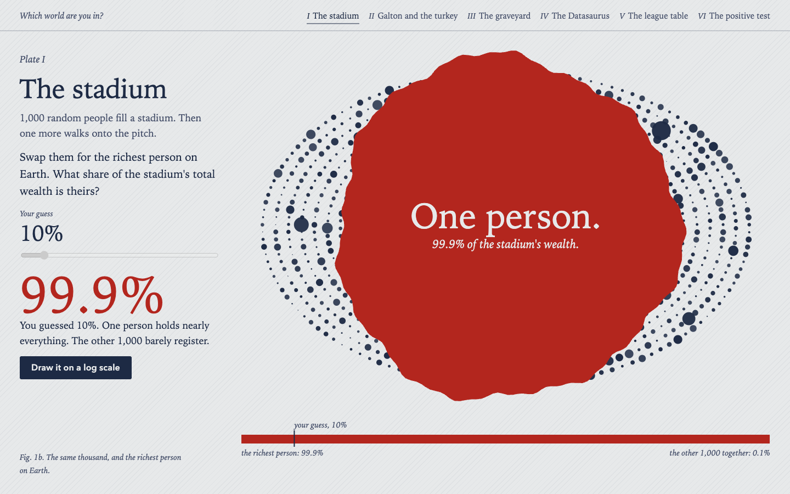

# Art of Data

The best visualizations we can make of very different kinds of data, published
openly. Plain HTML/SVG where that's enough; [three.js](https://threejs.org) where
the data needs 3D, scale, or motion.

**Live:** https://l69d.github.io/art-of-data/

## Gallery

| piece | dataset | built with |
|---|---|---|
| [Shipman deaths by age](https://l69d.github.io/art-of-data/shipman-data/age_by_year.html) | [Shipman Inquiry case decisions](shipman-data/) — 531 deaths, 1974–1998 | SVG + vanilla JS |
| [Which world are you in?](https://l69d.github.io/art-of-data/which-world/) | [Galton's family heights, the Datasaurus Dozen + figures from *The Black Swan* and *The Art of Statistics*](which-world/) — an atlas in six plates | canvas + SVG + vanilla JS, offline |

## Layout

One folder per dataset. Each one holds:

- `README.md` — sources, licence, row counts, caveats, how to rebuild from scratch
- the fetch/parse scripts, plus one `test_*.py` of plain asserts
- `derived/` — the analysis-ready tables the visualizations read
- the visualizations themselves, each a single self-contained `.html` file

## Conventions

- **No build step.** GitHub Pages serves the repo as-is (Jekyll renders this README
  as the home page). A visualization is one HTML file that opens straight from disk.
- **three.js** loads from a CDN through an `<script type="importmap">`, pinned to an
  exact version.
- **Raw scrapes stay out of git.** Only the fetch lists go in; each dataset's scripts
  rebuild the rest (see `.gitignore`).
- **Docs change with the code.** Any change to data, scripts or a visualization
  updates that dataset's README and adds a line to the log below in the same commit.

## Log

- **2026-09-04** — Shipman: mirrored the defunct Shipman Inquiry site from the Wayback
  Machine (3,579 pages), parsed 558 case decisions into CSV/JSONL, built the
  age-by-year scatter.
- **2026-09-05** — Shipman: added the Fourth/Fifth/Sixth Report text, PDF text,
  and the Sixth Report death tables.
- **2026-09-11** — Shipman: dropped 23 MB of unused evidence-catalogue pages and
  added `test_parse.py`. Created this repo and turned on GitHub Pages.
- **2026-09-24** — Which world are you in?: a four-room walk-up exhibit for the Claude
  community event (stadium, Galton vs the turkey, positive test, Shipman), with Galton's
  1886 heights fetched to `which-world/derived/`, `test_galton.py`, `test_model.mjs`
  and a talk outline.
- **2026-09-24** — Which world are you in? v2: rebuilt as an atlas in six plates on one
  persistent crowd of ink dots, with a log-scale beat on the stadium and three new plates
  (the graveyard, the Datasaurus, league table to funnel) plus framing on the positive test.
  Added `fetch_datasaurus.py`; `test_galton.py` became `test_data.py`. Shipman plate parked.
