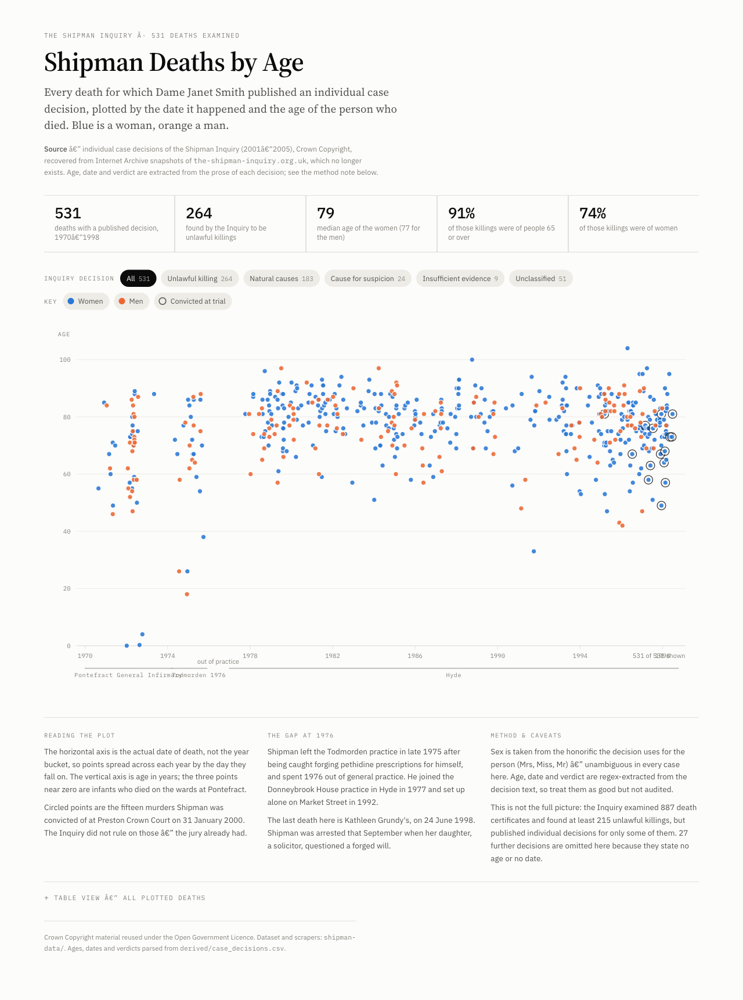
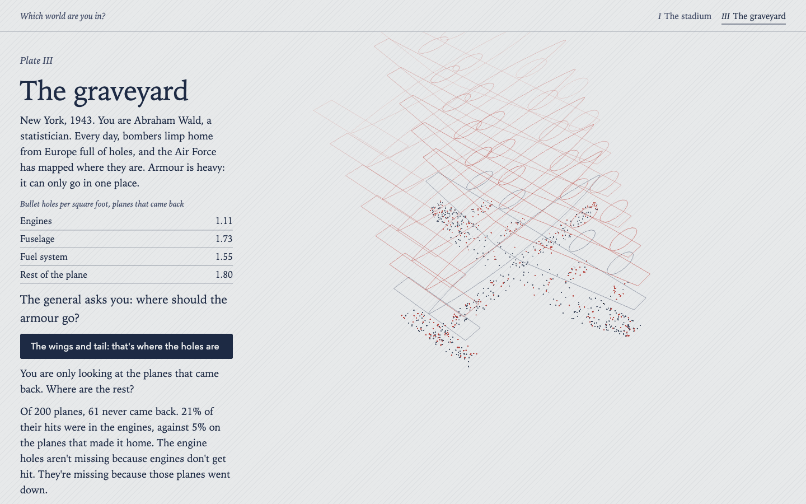
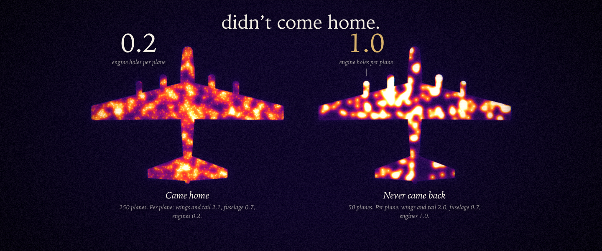

# Art of Data

The best visualizations we can make of very different kinds of data, published
openly. Plain HTML/SVG where that's enough; [three.js](https://threejs.org) where
the data needs 3D, scale, or motion.

**Live:** https://l69d.github.io/art-of-data/

## Gallery

| piece | dataset | built with |
|---|---|---|
| [Shipman deaths by age](https://l69d.github.io/art-of-data/shipman-data/age_by_year.html) | [Shipman Inquiry case decisions](shipman-data/) — 531 deaths, 1974–1998 | SVG + vanilla JS |
| [Which world are you in?](https://l69d.github.io/art-of-data/which-world/) | [Wald's bombers, the Datasaurus Dozen + figures from *The Black Swan* and *The Art of Statistics*](which-world/) — five dreamy stories you play from the driver's seat | three.js (vendored) + SVG, offline |
| [Where the holes aren’t](https://l69d.github.io/art-of-data/holes/) | [Wald's bombers: 300 simulated sorties, holes per plane by part](holes/) — a four-minute interactive film, every frame drawn live | WebGL2 + WebAudio, no libraries, offline |

## Layout

One folder per dataset. Each one holds:

- `README.md` — sources, licence, row counts, caveats, how to rebuild from scratch
- the fetch/parse scripts, plus one `test_*.py` of plain asserts
- `derived/` — the analysis-ready tables the visualizations read
- the visualizations themselves, each a single self-contained `.html` file

## Conventions

- **No build step.** GitHub Pages serves the repo as-is (Jekyll renders this README
  as the home page). A visualization is one HTML file that opens straight from disk.
- **three.js** loads from a CDN through an `<script type="importmap">`, pinned to an
  exact version.
- **Raw scrapes stay out of git.** Only the fetch lists go in; each dataset's scripts
  rebuild the rest (see `.gitignore`).
- **Docs change with the code.** Any change to data, scripts or a visualization
  updates that dataset's README and adds a line to the log below in the same commit.

## Log

- **2026-09-04** — Shipman: mirrored the defunct Shipman Inquiry site from the Wayback
  Machine (3,579 pages), parsed 558 case decisions into CSV/JSONL, built the
  age-by-year scatter.
- **2026-09-05** — Shipman: added the Fourth/Fifth/Sixth Report text, PDF text,
  and the Sixth Report death tables.
- **2026-09-11** — Shipman: dropped 23 MB of unused evidence-catalogue pages and
  added `test_parse.py`. Created this repo and turned on GitHub Pages.
- **2026-09-24** — Which world are you in?: a four-room walk-up exhibit for the Claude
  community event (stadium, Galton vs the turkey, positive test, Shipman), with Galton's
  1886 heights fetched to `which-world/derived/`, `test_galton.py`, `test_model.mjs`
  and a talk outline.
- **2026-09-24** — Which world are you in? v2: rebuilt as an atlas in six plates on one
  persistent crowd of ink dots, with a log-scale beat on the stadium and three new plates
  (the graveyard, the Datasaurus, league table to funnel) plus framing on the positive test.
  Added `fetch_datasaurus.py`; `test_galton.py` became `test_data.py`. Shipman plate parked.
- **2026-09-24** — Which world are you in? v3: every plate is now a story (take the seat,
  choose, watch it play out, moral of the story), rendered in three.js (vendored r149 for
  offline use), with Wald's bombers, the turkey's tower of days and a "Your record" finale.
  Galton dropped (data and fetch script removed).
- **2026-09-24** — Which world are you in? v4, the driver's seat: stories now play one card
  at a time with hands-on moments (open the gates, eat breakfast, turn the bomber over, open
  the letter), drag-to-look in every scene, and new engraved art (floodlights, propellers and
  a ghost formation, a sun over the turkey's tower, a ministry with its press pack, report
  sheets, Sarah). Review fixes from v3: idle reset clears the record, scrollbar-safe renderer,
  phone layout.
- **2026-09-25** — Which world are you in? v5: trimmed to five stories with Wald's bombers
  first; Wald told by the bullet count (holes per plane, part by part: engines 0.2 on the
  planes that came home, 1.0 on the ones that didn't); a dreamy, hand-inked look (watercolour
  washes, glowing floating points, gold dust, sketched lines, paper clouds and lanterns, a
  murmuration on the title page). The league table and the fund managers were cut.
- **2026-09-26** — Where the holes aren't: Wald's bombers alone, as a four-minute interactive
  film in `holes/`. You ride one of 300 simulated sorties through a raid, count the 748 holes
  of the 250 planes that came home through a dozen generative art media, choose where the
  armour goes, and watch the 50 lost planes' holes fall into the engines (0.2 holes per plane
  on the survivors, 1.0 on the lost). A hand-written WebGL2 engine and a synthesized score, no
  libraries; `test_model.mjs` and `test_film.py` check the numbers and that it runs offline.
  Built with Claude, with parallel Claude agents on the media, the sky, the airfield and the sound.
